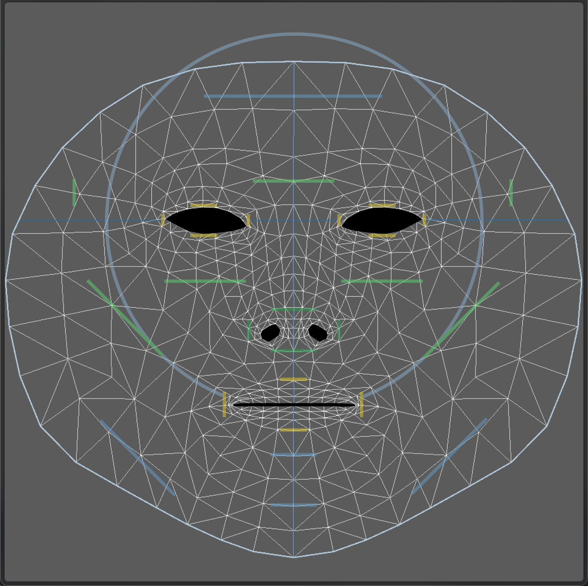

# Unity-ARFoundation-echo3D-demo-Face-Makeup

Simple face makeup demo with Unity, AR Foundation, and echo3D

## Register

Don't have an API key? Make sure to register for FREE at [echo3D](https://console.echo3D.co/#/auth/register).

## Setup

- Create a new Unity project.
- Clone the [Unity-ARFoundation-echo3D-example](https://github.com/echo3Dco/Unity-ARFoundation-echo3D-example) sample code.
- Open the sample scene under `AR Foundation\Scenes\FaceTracking\FaceMesh.unity`.
- [Set your API key](https://docs.echo3D.co/unity/using-the-sdk) in `echo3D.cs` inside the `echo3D\echo3D.prefab` using the the inspector.
- Select `AR Session Origin` in the hierarchy. Double click `FaceMeshPrefab` under `AR Face Manager` in the inspector. Set `Material Size` to 1
- [Add an image hologram](https://docs.echo3D.co/web-console/manage-pages/content-page/how-to-add-content) by uploading the *[makeup.png](./images/makeup.png)* file from the [images](./images) folder to the echo3D console.
- Overwrite the existing *echo3D/CustomBehaviour.cs* script with the new [*CustomBehaviour.cs*](./CustomBehaviour.cs) file.

## Create Makeup Texture

Make sure to use an **Alpha transparent texture** as a custom shader. The example texture contains eye shadows, eye liners, highlight, lipstick or other coloring. When running the app, it detects a face and overlays the face material. 

To create a makeup texture on your own, open the *[.psd](./model/canonical_face_texture.psd)* file in the [model](./model) folder. This model is provided by Google [ARCore Augmented Faces Demo](https://developers.google.com/ar/develop/developer-guides/creating-assets-for-augmented-faces)

## Learn more

Refer to our [documentation](https://docs.echo3D.co/unity/) to learn more about how to use Unity and echo3D.

## Support

Feel free to reach out at [support@echo3D.co](mailto:support@echo3D.co) or join our [support channel on Slack](https://go.echo3D.co/join).

## Screenshot

